# Mira Agent Architecture

> C4-style architecture reference for **Mira**, a domain-agnostic reference implementation of a
> production agentic-AI platform. Mira ships as a single Python package (`mira`, src-layout) with
> two demo domains — `research` (Markdown document corpus) and `finance` (CSV ledger) — standing in
> for whatever real domains an adopter plugs in via connectors and specialists.
>
> Decisions referenced throughout are recorded in the [ADR catalog](../adr/adr-list.md)
> (ADR-001 … ADR-048; numbers preserved from the originating initiative).
>
> Date: July 2026

---

## Implementation Status

This document describes the **full target architecture**. Not every component is implemented
today; the table below maps each architectural area to its current status and delivery phase so
the diagrams can stay complete without overstating what ships.

| Architectural area | Status | Phase | Where it lives / lands |
|--------------------|--------|-------|------------------------|
| Warm agent runtime (WSGI service, health probes, graceful shutdown) | **Implemented** | — | `mira.core.service` (ADR-008) |
| Middleware pipeline (auth → correlation → entitlement → guardrail-in → handler → guardrail-out → telemetry) | **Implemented** | — | `mira.core.middleware` (ADR-009) |
| SSE streaming + live run events | **Implemented** | — | `mira.core.streaming`, `mira.core.streaming_sse` |
| Attribution / decision-trace capture | **Implemented** | — | `mira.core.attribution` |
| Layered memory (working / session / long-term) | **Implemented** | — | `mira.core.memory` (ADR-017) |
| Agent-layer resilience (circuit breaker, backoff) | **Implemented** | — | `mira.core.resilience` (ADR-046) |
| LangGraph runtime + ReAct loop with budget bounds | **Implemented** | — | `mira.orchestration.runtime`, `mira.orchestration.reasoning` (ADR-007, ADR-013) |
| Specialist scaffold + research/finance demo specialists | **Implemented** | — | `mira.orchestration.specialist_scaffold`, `mira.orchestration.specialists` |
| MCP tool discovery from the agent side | **Implemented** | — | `mira.orchestration.mcp_tools` |
| Provider-agnostic model gateway (fallback chain, cost/quota routing, versioning registry) | **Implemented** | — | `mira.model.*` (ADR-010, ADR-011, ADR-012) |
| Providers (local echo, OpenAI-compatible, AWS) | **Implemented** | — | `mira.providers.*` (ADR-001, ADR-002) |
| Data fabric (federate-vs-aggregate policy, federation, storage roles, provenance) | **Implemented** | — | `mira.fabric.*` (ADR-019, ADR-021, ADR-024, ADR-025) |
| Connectors (docs, ledger) + MCP export + MCP server registry | **Implemented** | — | `mira.connectors.*` (ADR-020) |
| Typed tool contracts, invoke, authz | **Implemented** | — | `mira.tools.*` (ADR-031) |
| Deployment profiles (local, saas, standalone, kubernetes, outposts) | **Implemented** | — | `mira.config.profiles` (ADR-047) |
| Supervisor routing across specialists | **Implemented** (`mira.orchestration.supervisor`, `agent_cards`) | **B** | ADR-014 |
| Eval framework + CI safety gate | **Implemented** (`evals/`, `make eval`, CI-gated) | **B** | ADR-045 |
| Retrieval / RAG pipeline (hybrid, re-ranking, agentic RAG) | **Implemented** (`mira.retrieval`: hybrid RRF + corrective loop; in-memory reference backends) | **C** | ADR-028, ADR-029 |
| Graph RAG (entity extraction, knowledge graph, graph+vector fusion) | **Implemented** (`mira.semantic`: entities/KG/catalog/conflicts + fusion) | **C** | ADR-027, ADR-030 |
| Safety-pipeline detectors (injection, tool abuse, groundedness, topic drift) | **Implemented** (`mira.core.guardrails`); model-graded detectors deferred | **D** | ADR-036, ADR-037, ADR-038 |
| XAI engine (decision traces, uncertainty, `/explain` API) | **Implemented** (`mira.core.decision_trace`, `/explain`) | **D** | ADR-040, ADR-041 |
| AgentOps (cost attribution, SLOs/error budgets, incidents) | **Implemented** (`mira.model.cost_attribution`, `mira.config.slos`, `mira.core.incidents`) | **E** | ADR-042, ADR-043, ADR-044 |
| Dynamic workflow composition + agent scaffolding/generation | **Designed / planned** | **F** | ADR-015, ADR-016 |

Phase letters: **B** supervisor + evals · **C** retrieval / RAG / graph · **D** safety / XAI ·
**E** AgentOps · **F** composition / scaffolding.

---

## Level 1: System Context

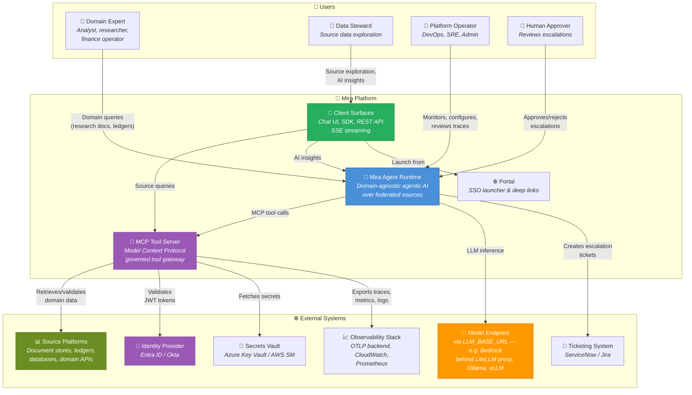

**Boundary notes.** The client surfaces (Chat UI, SDK, API) and their auth model are defined by
[ADR-005](../adr/adr-list.md) and [ADR-006](../adr/adr-list.md). The agent reaches every governed
data source through the MCP tool server — never directly ([ADR-020](../adr/adr-list.md)); the
demo `research` docs connector and `finance` ledger connector are exported over the same MCP
surface as any production connector would be.

---

## Level 2: Container Diagram

```mermaid
flowchart TB
    user["👤 Domain Expert"]
    steward["👤 Data Steward"]

    subgraph agent["🤖 Mira Agent Runtime"]
        api["📡 Agent API<br/><i>WSGI warm service<br/>+ SSE streaming</i>"]

        subgraph core["Core Services"]
            reasoning["🧠 Reasoning Engine<br/><i>ReAct loop, budget bounds,<br/>loop detection</i>"]
            rag["🔍 RAG Pipeline<br/><i>Retrieval, re-ranking,<br/>context assembly — Phase C</i>"]
            graphRag["🕸️ Graph RAG<br/><i>Entity extraction,<br/>graph retrieval — Phase C</i>"]
            tools["🔧 Tool Registry<br/><i>Typed contracts,<br/>MCP discovery</i>"]
        end

        subgraph support["Support Services"]
            memory["💾 Memory Manager<br/><i>Working, session,<br/>long-term</i>"]
            safety["🛡️ Safety Pipeline<br/><i>Guardrail-in/out stages;<br/>detectors — Phase D</i>"]
            xai["📋 XAI Engine<br/><i>Attribution today;<br/>explanations — Phase D</i>"]
            escalation["⚠️ Escalation Manager<br/><i>HITL triggers — Phase D</i>"]
            auth["🔐 Auth Module<br/><i>JWT, entitlements</i>"]
        end

        observability["📊 Observability<br/><i>OpenTelemetry</i>"]
    end

    subgraph mcpServer["🔌 MCP Tool Server"]
        mcpApi["📡 MCP API<br/><i>MCP Protocol endpoint</i>"]

        subgraph mcpSecurity["Security Layer"]
            jwtVal["🔐 JWT Validator<br/><i>JWKS, MFA check</i>"]
            auditLog["📝 Audit Logger<br/><i>Structlog JSON</i>"]
            rateLimit["🚦 Rate Limiter<br/><i>Redis-backed</i>"]
            secretsMgr["🔐 Secrets Manager<br/><i>Vault integration</i>"]
        end

        subgraph sourceTools["Source Tool Suite"]
            searchTool["🔍 Search Tools<br/><i>Query DSL</i>"]
            storageTool["💾 Storage Tools<br/><i>CRUD operations</i>"]
            entitleTool["👥 Entitlements<br/><i>ACL, groups</i>"]
            docsTool["📄 Docs Connector<br/><i>Markdown corpus<br/>(research demo)</i>"]
            ledgerTool["📒 Ledger Connector<br/><i>Accounts, transactions<br/>(finance demo)</i>"]
            fileTool["📁 File/Dataset<br/><i>Signed URLs</i>"]
            govTool["⚖️ Governance Service<br/><i>Tag management</i>"]
        end

        subgraph mcpResilience["Resilience"]
            circuitBreaker["🔌 Circuit Breaker<br/><i>Source protection</i>"]
            retryMgr["🔄 Retry Manager<br/><i>Exponential backoff</i>"]
            healthCheck["💚 Health Probes<br/><i>K8s ready/live</i>"]
        end
    end

    subgraph clientSurfaces["💬 Client Surfaces"]
        surfaceApi["📡 Surface API<br/><i>REST + SSE</i>"]
        chatUI["💬 Chat UI<br/><i>Streaming chat,<br/>live plan view</i>"]
        sdk["🧰 SDK<br/><i>Typed client</i>"]
        dataFed["🔀 Data Federation<br/><i>Cross-source</i>"]
        surfaceCache["⚡ Surface Cache<br/><i>Query optimization</i>"]
    end

    subgraph infra["🗄️ Infrastructure"]
        vectorStore[("📚 Vector Store<br/><i>role: vector index —<br/>pgvector default</i>")]
        graphDb[("🕸️ Knowledge Graph<br/><i>role: graph store</i>")]
        stateStore[("💿 State Store<br/><i>role: state/traces</i>")]
        cache[("⚡ Cache<br/><i>role: cache — Redis</i>")]
    end

    subgraph external["🌐 External"]
        sources["Source Platforms"]
        modelEp["Model Endpoint<br/><i>LLM_BASE_URL</i>"]
        idp["Identity Provider"]
        vault["Secrets Vault"]
    end

    user --> api
    steward --> surfaceApi
    api --> auth
    api --> reasoning
    reasoning --> rag
    reasoning --> graphRag
    reasoning --> tools
    reasoning --> memory
    reasoning --> safety
    reasoning --> xai
    reasoning --> escalation

    tools --> mcpApi
    surfaceApi --> mcpApi
    mcpApi --> jwtVal
    jwtVal --> idp
    mcpApi --> auditLog
    mcpApi --> rateLimit
    secretsMgr --> vault

    searchTool --> sources
    storageTool --> sources
    entitleTool --> sources
    docsTool --> sources
    ledgerTool --> sources
    fileTool --> sources
    govTool --> sources

    circuitBreaker --> sources

    rag --> vectorStore
    rag --> modelEp
    graphRag --> graphDb
    memory --> cache
    memory --> stateStore
    xai --> stateStore
    rateLimit --> cache
    surfaceCache --> cache

    chatUI --> api
    sdk --> api
    dataFed --> mcpApi

    style api fill:#4a90d9,stroke:#2c5aa0,color:#fff
    style mcpApi fill:#9b59b6,stroke:#8e44ad,color:#fff
    style surfaceApi fill:#27ae60,stroke:#1e8449,color:#fff
    style reasoning fill:#e74c3c,stroke:#c0392b,color:#fff
    style rag fill:#27ae60,stroke:#1e8449,color:#fff
    style graphRag fill:#8e44ad,stroke:#7d3c98,color:#fff
```

**Container notes.**

- The **Agent API** is a persistent (warm) WSGI service per [ADR-008](../adr/adr-list.md); every
  request traverses the ordered middleware pipeline of [ADR-009](../adr/adr-list.md) before it
  reaches the reasoning engine, and again on the way out.
- The **Source Tool Suite** hosts connectors behind one governed MCP boundary
  ([ADR-020](../adr/adr-list.md)); the docs and ledger connectors are demo stand-ins for any
  production source (a data platform, an ERP, a document management system, a time-series
  historian, …).
- **Infrastructure engines are role-based** per [ADR-021](../adr/adr-list.md): four storage roles
  (knowledge graph, vector index, state/cache, relational) with engines as per-profile defaults —
  never hard commitments. The portable default for the vector and relational roles is
  **Postgres + pgvector**.

---

## Level 3: Component Diagrams

### 3.1 Reasoning Engine

Implemented today as the ReAct loop of [ADR-013](../adr/adr-list.md) in
`mira.orchestration.reasoning` — plan/act/observe/reflect as LangGraph nodes with layered hard
bounds (`recursion_limit`, token/time/cost ceilings, `interrupt()` HITL gates via
`mira.orchestration.interrupts`).

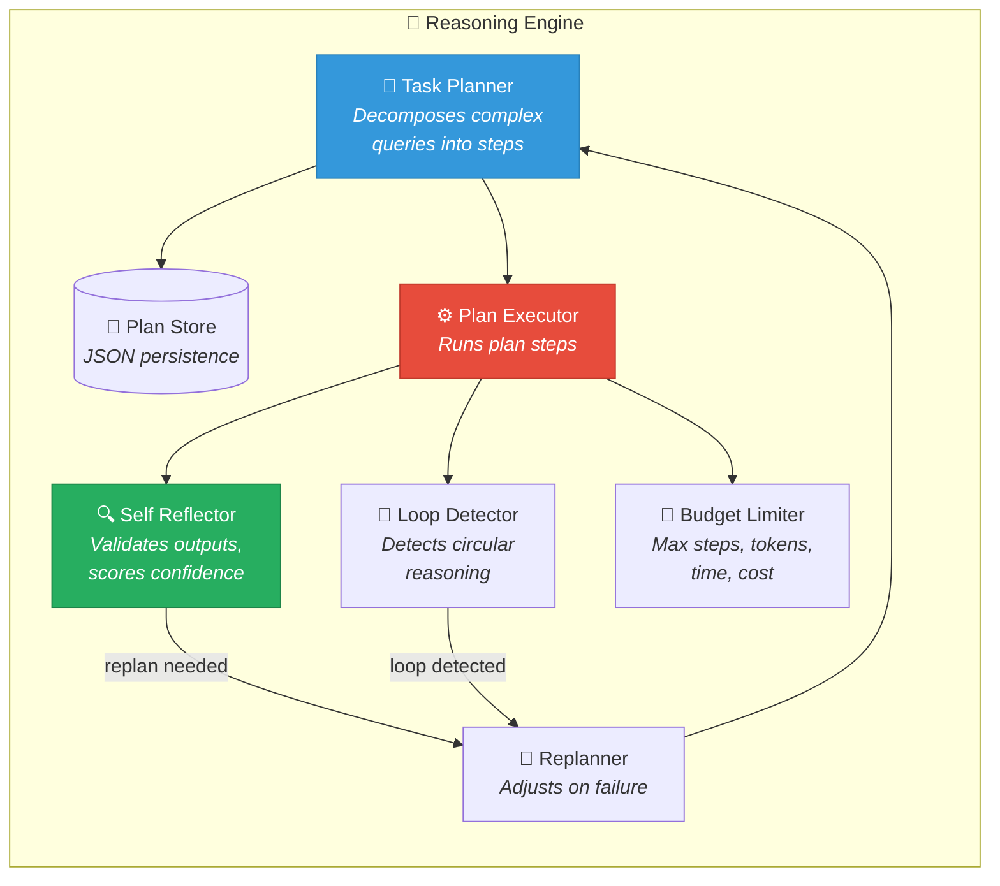

### 3.2 RAG Pipeline *(Phase C — implemented in `mira.retrieval`)*

Retrieval quality design per [ADR-028](../adr/adr-list.md) (hybrid retrieval) and
[ADR-029](../adr/adr-list.md) (agentic RAG). The demo corpora are the research Markdown docs and
the finance ledger exports.

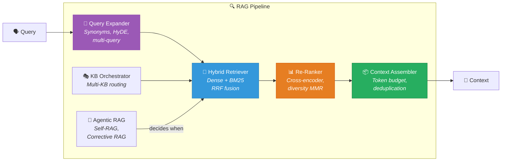

### 3.3 Graph RAG *(Phase C — implemented in `mira.semantic`)*

Graph + vector fusion per [ADR-030](../adr/adr-list.md) over the knowledge-graph spine of
[ADR-027](../adr/adr-list.md). Entities are whatever the active domain defines — for the demo
domains: research topics, authors, and citations; finance accounts, counterparties, and
transactions.

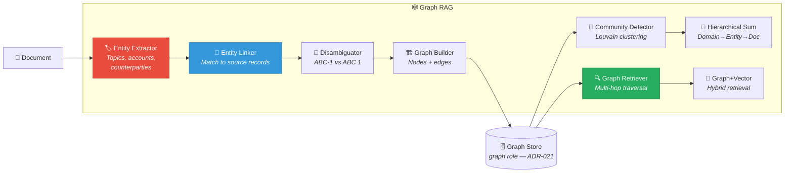

### 3.4 Memory Architecture

Implemented in `mira.core.memory` per [ADR-017](../adr/adr-list.md); integrity and embedding
versioning per [ADR-018](../adr/adr-list.md).

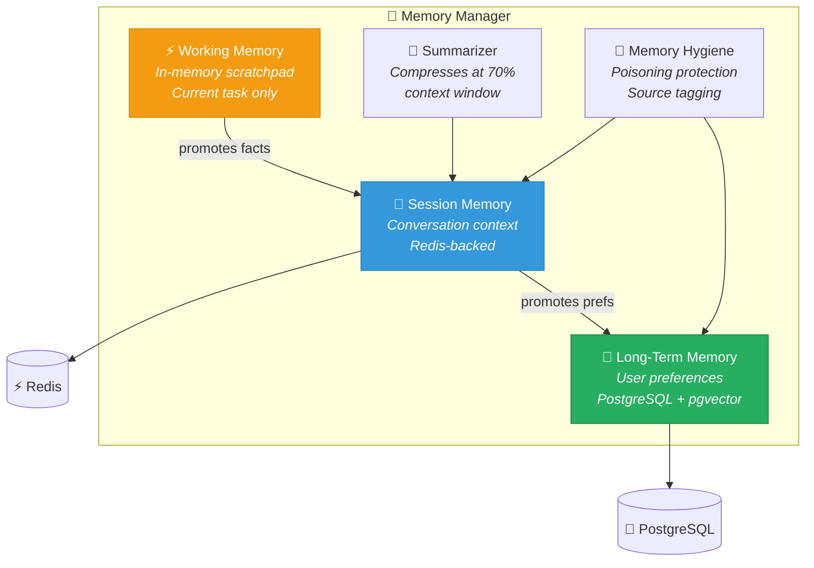

### 3.5 Safety Pipeline *(stages + Phase-D detectors implemented)*

The guardrail-IN and guardrail-OUT **stages** exist today in the middleware pipeline
([ADR-009](../adr/adr-list.md), [ADR-037](../adr/adr-list.md)); the individual **detectors**
below are Phase D ([ADR-036](../adr/adr-list.md), [ADR-038](../adr/adr-list.md)). The pipeline is
custom and portable; a hosted guardrail service (e.g. a managed guardrails product behind the
model endpoint) is an optional secondary defense-in-depth layer, not a dependency.

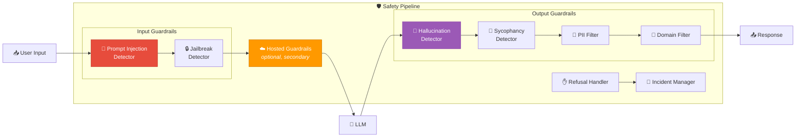

### 3.6 XAI Engine *(attribution, decision traces, and `/explain` implemented)*

Trace capture and attribution ship today in `mira.core.attribution`; decision-trace audit and the
`/explain` API with uncertainty quantification are [ADR-040](../adr/adr-list.md) and
[ADR-041](../adr/adr-list.md).

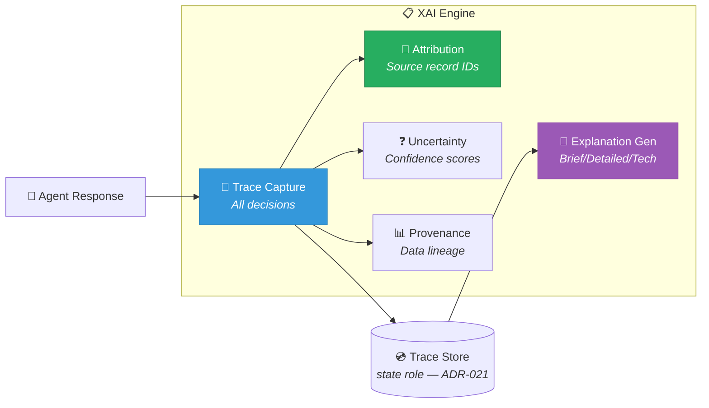

### 3.7 Domain Semantics & Data Fabric

Implemented in `mira.fabric.*`: the federate-vs-aggregate policy
([ADR-019](../adr/adr-list.md)), storage roles ([ADR-021](../adr/adr-list.md)), and provenance
([ADR-024](../adr/adr-list.md), [ADR-025](../adr/adr-list.md)). Entity resolution, normalization,
and the catalog/graph spine are Phase 2+ designs ([ADR-022](../adr/adr-list.md) –
[ADR-027](../adr/adr-list.md)). The demo entity chains are `Corpus→Document→Section` (research)
and `Account→Ledger→Entry` (finance).

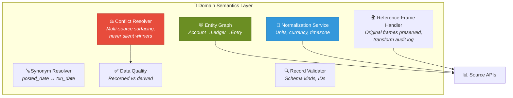

### 3.8 Tool Registry

Implemented in `mira.tools.*` per [ADR-031](../adr/adr-list.md): flat-JSON-Schema typed
contracts with annotations (readOnly / idempotent / destructive / openWorld), idempotency keys,
retry/timeout, and declared authorization. Skills compose tools per
[ADR-032](../adr/adr-list.md); versions resolve through the [ADR-012](../adr/adr-list.md)
registry.

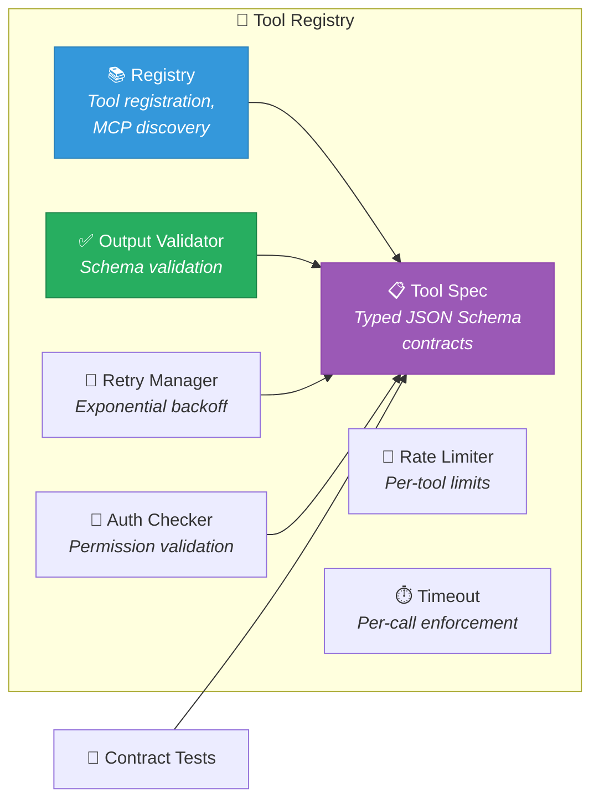

### 3.9 Auth & Entitlements

Phase-1 identity slice per [ADR-033](../adr/adr-list.md) (service identity with per-call
tenant/user/correlation attribution); per-agent identity with task-scoped tokens (OAuth 2.0 Token
Exchange, RFC 8693) per [ADR-034](../adr/adr-list.md). Entitlement enforcement lives at the MCP
tool boundary; the agent layer only narrows scope.

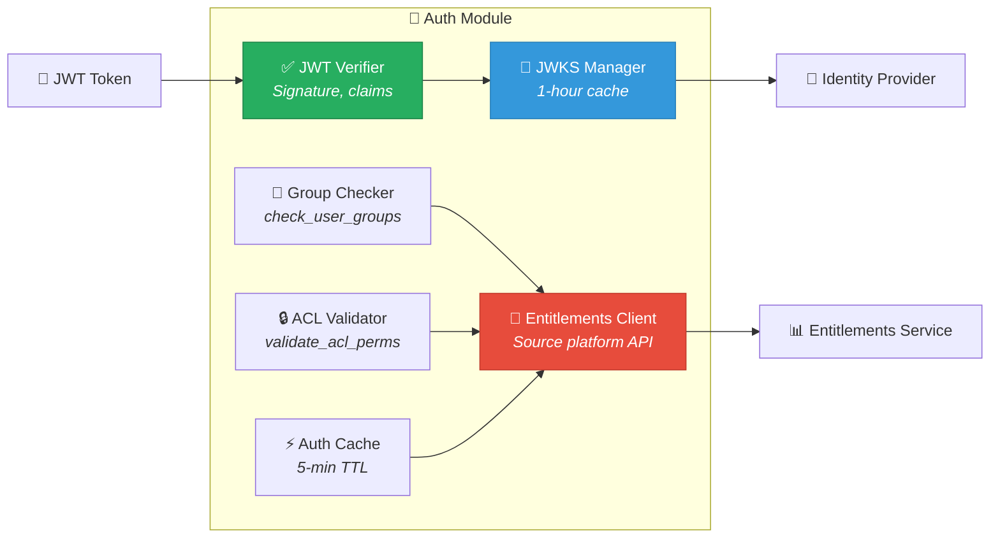

### 3.10 Observability

OpenTelemetry tracing with cost spans (`mira.model.cost_spans`); AgentOps dashboards and
anomaly-triggered incident workflows are Phase E ([ADR-042](../adr/adr-list.md) –
[ADR-044](../adr/adr-list.md)).

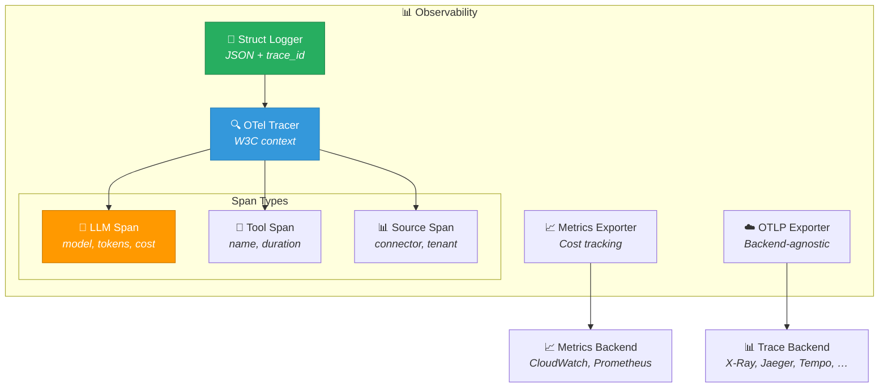

### 3.11 MCP Tool Server Security Layer

Owned at the tool boundary (inherited platform decisions); the agent layer conforms rather than
re-implements — see the inherited-constraints section of the [ADR catalog](../adr/adr-list.md).

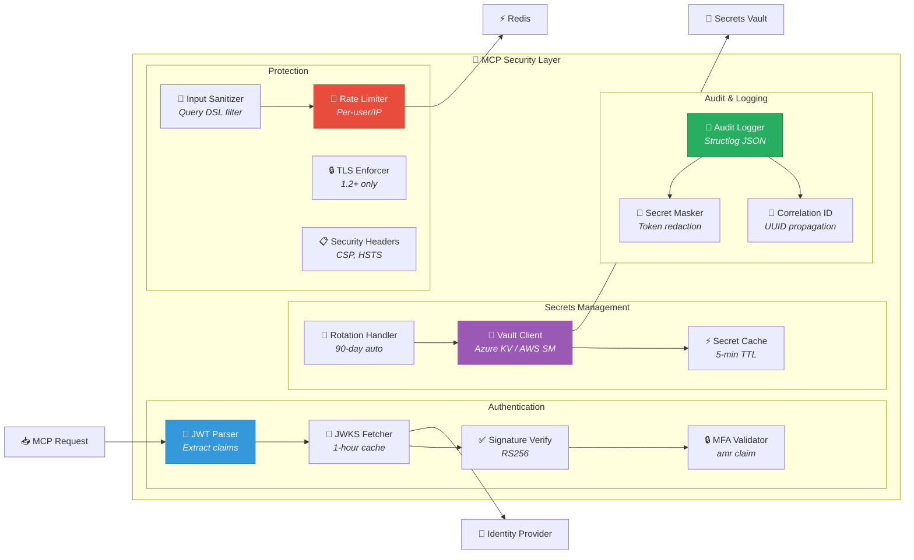

### 3.12 MCP Tool Server — Source Tools

Connectors register through the MCP server registry (`mira.connectors.mcp_registry`) and export
their tools via `mira.connectors.mcp_export` per [ADR-020](../adr/adr-list.md). The two demo
connectors below illustrate the pattern; production deployments swap in their own.

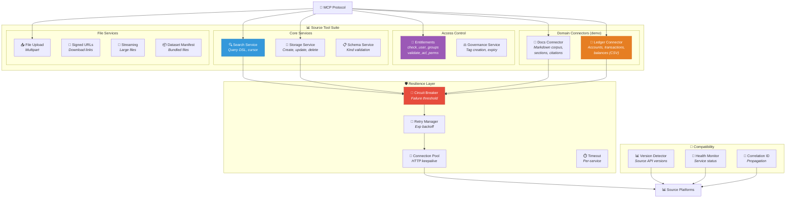

### 3.13 Client Surfaces & Demo Domain Workspaces

The generic client surfaces of [ADR-005](../adr/adr-list.md): Chat UI, SDK, and REST API. Domain
workspaces are thin views over the same agent API — the two shown are the demo domains; a real
deployment replaces them with its own.

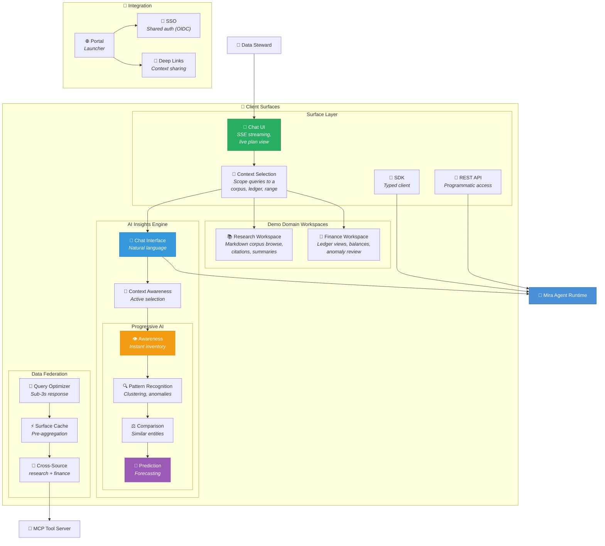

---

## Level 4: Deployment (AWS reference profile)

This is the **AWS reference deployment** (`saas` / `kubernetes` profiles). Two portability rules
qualify everything in this diagram:

1. **Storage engines are role-based** per [ADR-021](../adr/adr-list.md). RDS/pgvector,
   ElastiCache, OpenSearch, Neptune, and DynamoDB below are per-profile defaults for the
   relational, cache, vector, graph, and state roles — not commitments. The portable default
   across all profiles is **Postgres + pgvector** (which can serve the relational, vector, and
   state roles on its own in the `local` and `standalone` profiles).
2. **The model endpoint is indirected via `LLM_BASE_URL`** ([ADR-010](../adr/adr-list.md)). The
   gateway speaks an OpenAI-compatible protocol to whatever sits behind that URL — e.g. Bedrock
   behind a LiteLLM proxy, Ollama, or vLLM — so the "Model Endpoint" box is a placeholder, not a
   cloud dependency.

Deployment profiles ([ADR-047](../adr/adr-list.md)): `local`, `saas`, `standalone`,
`kubernetes`, `outposts` — one artifact, profile-driven placement. Network isolation per
[ADR-048](../adr/adr-list.md).

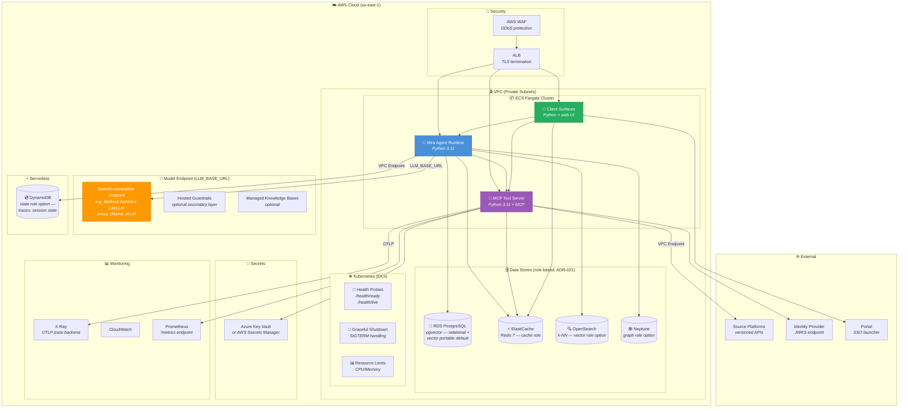

---

## Data Flow

End-to-end request path. Steps 2–5 and 10–12 are the middleware pipeline of
[ADR-009](../adr/adr-list.md); step 6 is the ReAct loop of [ADR-013](../adr/adr-list.md); steps
All numbered flows ship today; model-graded detector variants and live-provider retrieval quality remain deferred (see the ADR Deferred sections).

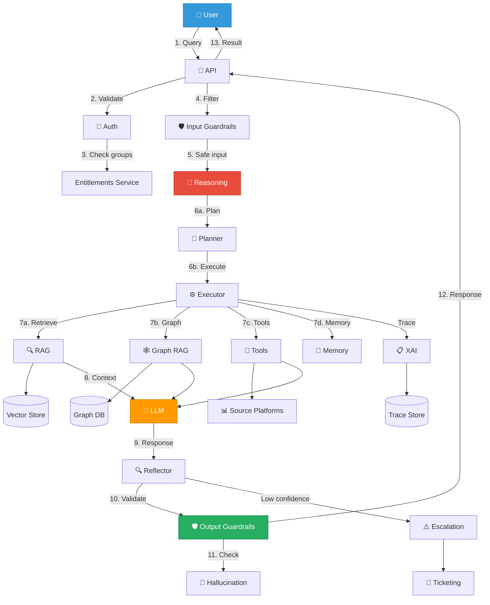

---

## Capability Matrix

### Agent Production Hardening

| Capability | Container | Key Components | External Dependencies | Status |
|------------|-----------|----------------|----------------------|--------|
| `provider-abstraction` | All | ILLMProvider, ISecretsProvider, Factory | None | Implemented (ADR-002) |
| `agent-eval-framework` | Eval Runner | Golden datasets, Safety evals, Domain evals | CI/CD | Phase B (ADR-045) |
| `auth-security` | Auth Module | JWT Verifier, JWKS Manager | Identity Provider | Implemented (ADR-033) |
| `hitl-escalation` | Escalation Manager | Trigger detection, State persistence | Ticketing System | Phase D (ADR-039) |
| `entitlements-integration` | Auth Module | Group Checker, ACL Validator | Entitlements Service | Implemented |
| `observability-tracing` | Observability | OTel Tracer, Span instrumentation | OTLP backend | Implemented |
| `infra-hardening` | Infrastructure | VPC endpoints, Rate limiting | Cloud VPC | Implemented (ADR-048) |
| `agent-reasoning-patterns` | Reasoning Engine | Planner, Reflector, Loop Detector, Budgets | None | Implemented (ADR-013) |
| `supervisor-routing` | Orchestration | Supervisor subgraph, specialist dispatch, agent cards | None | Phase B (ADR-014, ADR-035) |
| `domain-semantics` | Domain Semantics Layer | Entity Graph, Normalization, Synonyms | Source APIs | Fabric implemented; semantics Phase 2 (ADR-022–027) |
| `tool-design-standards` | Tool Registry | Typed JSON Schema contracts, Contract tests | None | Implemented (ADR-031) |
| `memory-architecture` | Memory Manager | Working, Session, Long-term | Redis, PostgreSQL | Implemented (ADR-017) |
| `xai-explainability` | XAI Engine | Trace Capture, Attribution, Explanations | State store | Attribution implemented; rest Phase D (ADR-040/041) |
| `safety-alignment` | Safety Pipeline | Input/Output Guardrails, Hallucination | Optional hosted guardrails | Stages implemented; detectors Phase D (ADR-037) |
| `rag-retrieval-quality` | RAG Pipeline | Chunking, Hybrid Search, Re-ranking | Vector store | Phase C (ADR-028) |
| `graph-rag-integration` | Graph RAG | Entity Extraction, Knowledge Graph | Graph store | Phase C (ADR-030) |

### MCP Tool Server Production Hardening

| Capability | Container | Key Components | External Dependencies | Status |
|------------|-----------|----------------|----------------------|--------|
| `jwt-signature-validation` | MCP Security | JWKS Fetcher, RS256, Expiry/Audience | OIDC Provider | Inherited (tool boundary) |
| `audit-logging-framework` | MCP Security | Structlog JSON, Correlation IDs | Log aggregation | Inherited |
| `mfa-enforcement` | MCP Security | amr claim validator | Identity Provider | Inherited |
| `secrets-vault-integration` | MCP Security | Vault Client, 5-min cache, Rotation | Azure KV / AWS SM | Inherited |
| `tls-https-enforcement` | MCP Security | TLS 1.2+, HTTPS redirect | ALB/Ingress | Inherited |
| `container-security-hardening` | Infrastructure | Non-root UID, Resource limits, Trivy | CI/CD | Inherited |
| `rate-limiting-ddos-protection` | MCP Security | Per-user/IP limits, Redis backend | Redis | Inherited |
| `input-sanitization` | MCP Security | Query DSL filter, Injection prevention | None | Inherited |
| `health-readiness-probes` | MCP Resilience | /health/liveness, /health/readiness | Kubernetes | Inherited; agent-side implemented (ADR-008) |
| `graceful-shutdown-handling` | MCP Resilience | SIGTERM, 30s grace period | Kubernetes | Inherited; agent-side implemented |
| `secrets-masking-logs` | MCP Security | Token/password redaction | None | Inherited |
| `entitlements-service-tools` | Source Tools | check_user_groups, validate_acl_perms | Entitlements Service | Inherited |
| `ledger-connector-tools` | Source Tools | Accounts, Transactions, Balances | Ledger source (demo: CSV) | Implemented (`mira.connectors.ledger`) |
| `docs-connector-tools` | Source Tools | Corpus search, Sections, Citations | Docs source (demo: Markdown) | Implemented (`mira.connectors.docs`) |
| `file-dataset-service` | Source Tools | Signed URLs, Streaming, Manifests | Source file service | Inherited |
| `governance-tag-tools` | Source Tools | Tag creation, Expiry management | Source governance service | Inherited |
| `correlation-id-propagation` | Source Tools | UUID generation, Header propagation | None | Inherited; agent forwards (ADR-009) |
| `retry-exponential-backoff` | MCP Resilience | 429/503 handling, Max retries | None | Inherited; agent-layer per ADR-046 |
| `source-version-compatibility` | Source Tools | Source API version detection | Source Platforms | Inherited (ADR-020: sources are versioned adapters) |
| `prometheus-metrics-endpoint` | MCP Observability | /metrics, Request counts, Latencies | Prometheus | Inherited |
| `distributed-tracing-opentelemetry` | MCP Observability | Trace context, Span creation | OTLP backend | Inherited |
| `circuit-breaker-pattern` | MCP Resilience | Failure threshold, Half-open state | None | Inherited; agent-layer implemented (ADR-046) |
| `security-headers-middleware` | MCP Security | CSP, HSTS, X-Frame-Options | None | Inherited |
| `pii-data-classification` | MCP Security | Field encryption, Data masking | None | Inherited |
| `http-connection-pooling` | MCP Resilience | Keepalive, Pool limits | None | Inherited |

> "Inherited" rows are owned by the governed MCP tool server (an upstream platform component);
> Mira consumes them as constraints — see the inherited-constraints table in the
> [ADR catalog](../adr/adr-list.md). Where the same concern also exists at the agent layer
> (health probes, retries, circuit breaking), the agent-side implementation is noted.

### Client Surfaces

| Capability | Container | Key Components | External Dependencies | Status |
|------------|-----------|----------------|----------------------|--------|
| `workspace-visualization` | Client Surfaces | Domain workspaces, Context selection | None | Demo workspaces (research, finance) |
| `ai-insights` | Client Surfaces | Chat UI, Context Awareness, Progressive AI | Mira Agent API | Chat + streaming implemented; progressive AI Phase C/D |
| `cross-source-federation` | Data Federation | Multi-source queries, Surface caching | MCP Tool Server | Implemented (`mira.fabric.federation`, ADR-019) |
| `portal-integration` | Integration | SSO, Deep links, Portal launch | Portal (OIDC) | Designed (ADR-005) |
| `performance-optimization` | Data Federation | Query optimizer, Sub-3s response | Redis | Designed |
| `natural-language-interface` | AI Insights | Chat interface, Contextual queries | Mira Agent API | Implemented (SSE streaming, live run events) |

---

## Technology Stack

### Core Platform

| Layer | Technology | Purpose |
|-------|------------|---------|
| **Runtime** | Python 3.11, WSGI warm service (`mira.core.service`) | Agent API and orchestration (ADR-008) |
| **Orchestration** | LangGraph (confined to `mira.orchestration` per ADR-007) | Durable ReAct execution with loop bounds |
| **LLM** | Provider-agnostic gateway → `LLM_BASE_URL` endpoint (Bedrock via LiteLLM proxy, Ollama, vLLM, any OpenAI-compatible) | Language model inference (ADR-010) |
| **Vector Store** | pgvector (portable default) or OpenSearch k-NN | Document embeddings and retrieval (role-based, ADR-021) |
| **Graph Store** | Neptune, Neo4j, or embedded alternative | Knowledge graph persistence (role-based, ADR-021) |
| **Cache** | Redis (ElastiCache in AWS profile) | Session memory, JWKS cache, Rate limiting |
| **State Store** | DynamoDB (AWS profile) or Postgres | Decision traces, session state (role-based, ADR-021) |
| **Relational** | PostgreSQL (RDS in AWS profile) | Long-term memory with pgvector |
| **Observability** | OpenTelemetry → OTLP backend (X-Ray, Jaeger, Tempo), CloudWatch/Prometheus | Tracing, logging, metrics |
| **Auth** | PyJWT, OIDC | Token verification (ADR-033/034) |
| **NLP** | spaCy, sentence-transformers | Entity extraction, re-ranking (Phase C) |
| **Container** | ECS Fargate / EKS (AWS profile); plain Docker/K8s elsewhere | Container runtime (ADR-047) |
| **Network** | VPC Private Mode | Network isolation (ADR-048) |

### MCP Tool Server

| Layer | Technology | Purpose |
|-------|------------|---------|
| **Protocol** | Model Context Protocol (MCP) | AI tool interface standard (Streamable HTTP; StdIO local) |
| **Auth** | python-jose, JWKS | JWT validation with key rotation |
| **Secrets** | Azure Key Vault / AWS Secrets Manager / env | Credential management (pluggable backend) |
| **Logging** | structlog | Structured JSON audit logging |
| **Rate Limiting** | slowapi + Redis | Distributed request throttling |
| **Resilience** | tenacity, circuitbreaker | Retry logic, circuit breakers |
| **HTTP** | httpx | Async HTTP with connection pooling |
| **Metrics** | prometheus-client | /metrics endpoint |
| **Tracing** | opentelemetry-sdk | Distributed tracing |
| **Security** | Trivy, pip-audit | Container and dependency scanning |

### Client Surfaces

| Layer | Technology | Purpose |
|-------|------------|---------|
| **Chat UI** | Web UI over SSE | Streaming chat with live plan view |
| **SDK** | Typed Python client | Programmatic agent access (ADR-005) |
| **Backend** | Same WSGI service (`mira.app`) | Surface API endpoints |
| **Caching** | Redis | Surface query cache |
| **AI** | Mira Agent API | Natural language insights (via agent) |
| **Integration** | OAuth2, OIDC | Portal SSO |
| **Data Federation** | Async queries (`mira.fabric.federation`) | Cross-source aggregation (ADR-019) |
